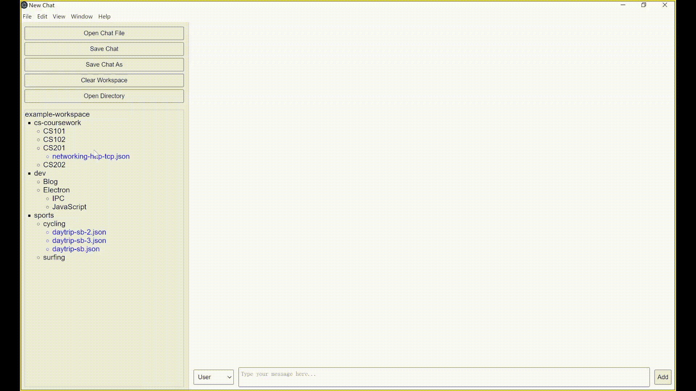
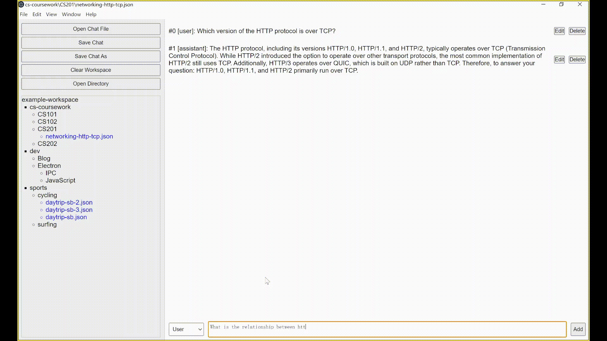
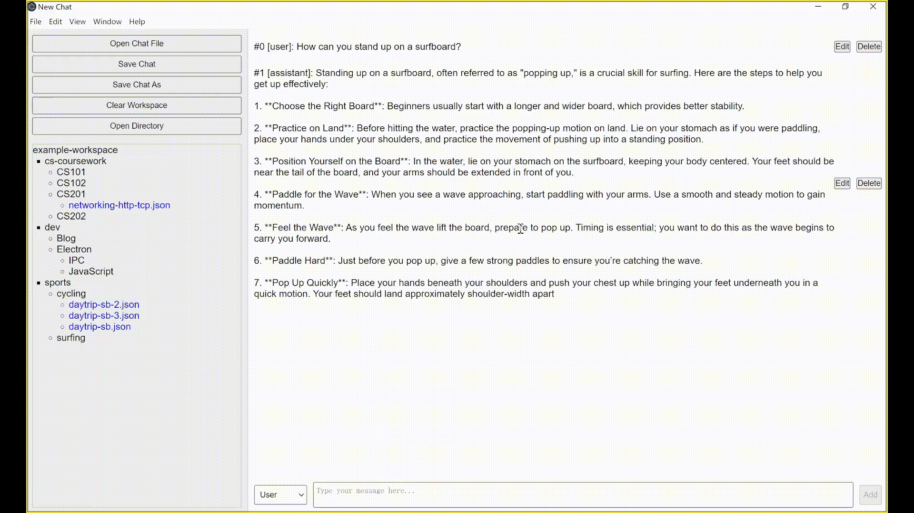

# Manage your Chat Sessions in a Directory

## Demonstrations

View your chat sessions in a directory tree and switch between chats

Create a new chat or continue a previous chat, using ChatGPT to generate response

Save your chat sessions as a json file in the directory tree

## How to run the application with the source code

1. Create a .env file in this directory containing your OpenAI API key "OPENAI_API_KEY=<your-api-key>"
2. `npm install`
3. `npm start`

## How to package the project to a desktop application

1. npm install
2. npm run make
3. the packaged application is in the out/ folder. (Note: Your OpenAI API key in the .env file is included in the packaged application)